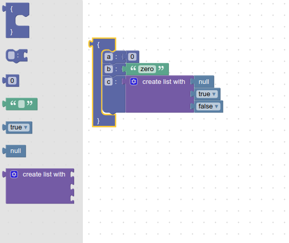
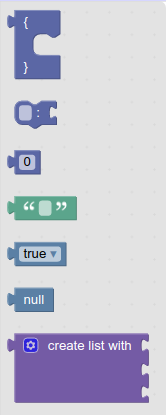
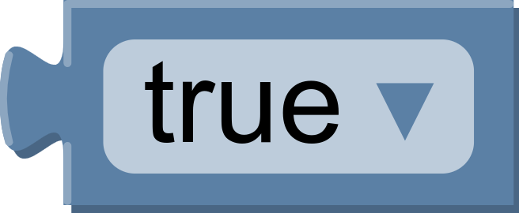
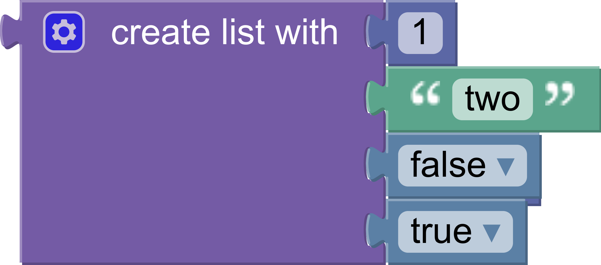
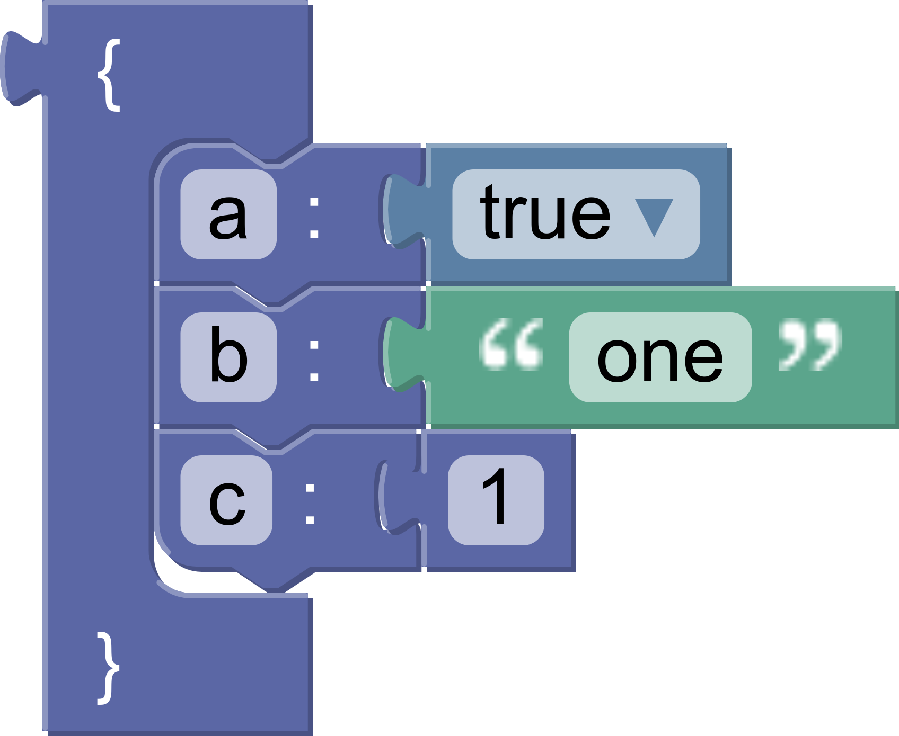

author: Rachel Fenichel
summary: Codelab showing how to create and use a custom generator.
id: custom-generator
categories: blockly,codelab,generator
status: Draft
Feedback Link: https://github.com/google/blockly-samples/issues/new

# Build a custom generator

## Codelab overview

### What you'll learn
- How to create a custom language generator.
- How to create block generator definitions for existing blocks.
- How to create block generator definitions for new blocks.
- How to use a custom generator in the playground.

### What you'll build

You will build a JSON generator that implements the [JSON language spec](https://www.json.org/json-en.html).



### What you'll need

- Familiarity with JSON and the JSON specification.
- Comfort with defining blocks and toolboxes.

This codelab assumes that you are already comfortable with using the Blockly playground locally.

## Setup

In this codelab you will add code to the Blockly playground to create and use a new generator.

### The playground

You will make all of your changes in the advanced playground, which you can find at `tests/advanced_playground.html`. This playground contains all of Blockly's base blocks, as well as some developer tools to make testing easier.

To start, create a file named `custom_generator.js` in the same folder as the playground.  Include it with a script tag.

```
<script src="custom_generator.js"></script>
```

Note: you must include your custom code *after* including the Blockly library.

### Blocks

For this codelab you will use two custom blocks, as well as five blocks from Blockly's standard set.

The custom blocks represent the *Object* and *Member* sections of the JSON specification.

The blocks are:
- `object`
- `member`
- `math_number`
- `text`
- `logic_boolean`
- `logic_null`
- `lists_create_with`

### Custom block definitions

Copy this code into `custom_generator.js` to define the two custom blocks.

```js
Blockly.defineBlocksWithJsonArray([{
  "type": "object",
  "message0": "{ %1 %2 }",
  "args0": [
    {
      "type": "input_dummy"
    },
    {
      "type": "input_statement",
      "name": "MEMBERS"
    }
  ],
  "output": null,
  "colour": 230,
},
{
  "type": "member",
  "message0": "%1 %2 %3",
  "args0": [
    {
      "type": "field_input",
      "name": "MEMBER_NAME",
      "text": ""
    },
    {
      "type": "field_label",
      "name": "COLON",
      "text": ":"
    },
    {
      "type": "input_value",
      "name": "MEMBER_VALUE"
    }
  ],
  "previousStatement": null,
  "nextStatement": null,
  "colour": 230,
}]);
```

### Toolbox definition

Next, define your toolbox in XML. For this example we have a flyout-only toolbox with seven blocks in it.

Copy this code into `custom_generator.js`:

```js
var codelabToolbox = `
<xml id="toolbox" style="display: none">
<block type="object"/>
<block type="member"></block>
<block type="math_number"><field name="NUM">0</field></block>
<block type="text"><field name="TEXT"/></block>
<block type="logic_boolean"><field name="BOOL">TRUE</field></block>
<block type="logic_null"/>
<block type="lists_create_with"><mutation items="3"/></block>
</xml>
`
```

Then update the options struct in the playground to use your new toolbox:

```js
var defaultOptions = {
  comments: true,
  // ...
  toolbox: codelabToolbox,
  // ...
};
```

Your toolbox should look like this:



## The basics

A *language generator* defines basic properties of your language, such as how indentation works. *Block generators* define how individual blocks are turned into code, and must be defined for every block you use.

A language generator has a single entry point: `workspaceToCode`. This function takes in a workspace and:
- Initializes the generator and any necessary state by calling `init`.
- Walks the list of top blocks on the workspace and calls `blockToCode` on each top block.
- Cleans up any leftover state by calling `finish`.
- Returns the generated code.

### Create your language generator

The first step is to define and call your language generator.

A custom language generator is simply an instance of `Blockly.Generator`. Call the constructor, passing in your generator's name, and store the result.

```js
const codelabGenerator = new Blockly.Generator('JSON');
```

### Generate code

Add a button to the playground to generate JSON:

```html
<input type="button" value="To JSON" onclick="toJSON()">
```

Implement `toJSON` so that it generates code and outputs it to two places: the console, and the playground's text area.

```js
function toJSON() {
  const output = document.getElementById('importExport');
  const generatedCode = codelabGenerator.workspaceToCode(workspace);
  output.value = generatedCode;
  console.log(generatedCode);
  taChange();
}
```

### Test it

Put a number block on the workspace, then click your button to call your generator.

Check the console for the output. You should see an error:

```
generator.js:182 Uncaught Error: Language "JSON" does not know how to generate  code for block type "math_number".
    at Blockly.Generator.blockToCode (generator.js:182)
    at Blockly.Generator.workspaceToCode (generator.js:94)
    at <anonymous>:1:18
```

This error occurs because you need to write a block generator for each type of block. Read the next section for more details.

## Block generator overview

At its core, a block generator is a function that takes in a block, translates the block into code, and returns that code as a string.

Block generators are defined on the language generator object. For instance, here is the code to add a block generator for blocks of type `sample_block` on a language generator object (`sampleGenerator`).

```js
sampleGenerator['sample_block'] = function(block) {
  return 'my code string';
}
```

### Statement blocks
Statement blocks represent code that does not have an output connection.

A statement block's generator simply returns a string.

For example, this code defines a block generator that always returns the same function call.

```js
sampleGenerator['left_turn_block'] = function(block) {
  return 'turnLeft()';
}
```

### Value blocks

Value blocks represent code that returns a value.

A value block's generator returns an array containing a string and a [precedence value](https://developers.google.com/blockly/guides/create-custom-blocks/operator-precedence).

For example, this code defines a block generator that always returns `1 + 1`:

```js
sampleGenerator['two_block'] = function(block) {
  return ['1 + 1', sampleGenerator.ORDER_ADDITION];
}
```

### Operator precedence

Operator precedence rules determine how the correct order of operations is maintained during parsing. In Blockly's generators, operator precedence determines when to add parentheses.

--> Read more about [operator precedence in JavaScript](https://developer.mozilla.org/en-US/docs/Web/JavaScript/Reference/Operators/Operator_Precedence).

--> Read more about [operator precedence in Blockly](https://developers.google.com/blockly/guides/create-custom-blocks/operator-precedence).

Since JSON does not allow values that are expressions, you do not need to consider operator precedence for the generator that you are building in this codelab. You can use the same value everywhere a precedence value is required. In this case, we'll call it `PRECEDENCE`.

You need to be able to access this value inside your block generators, so add `PRECEDENCE` to your language generator:

```js
codelabGenerator.PRECEDENCE = 0;
```

## Value block generators

In this step you will build the generators for the simple value blocks: `logic_null`, `text`, `math_number`, and `logic_boolean`.

You will use `getFieldValue` on several types of fields.

### Null

The simplest block in this example is the `logic_null` block.


No matter what, it generates the code `'null'`. Notice that this is a string, because all generated code is a string.


```js
codelabGenerator['logic_null'] = function(block) {
  return ['null', codelabGenerator.PRECEDENCE];
};
```

### String

Next is the `text` block.


Unlike `logic_null`, there is a single text input field on this block. Use `getFieldValue`:

```js
var textValue = block.getFieldValue('TEXT');
```

Since this is a string in the generated code, wrap the value in quotation marks and return it:

```js
codelabGenerator['text'] = function(block) {
  var textValue = block.getFieldValue('TEXT');
  var code = '"' + textValue + '"';
  return [code, codelabGenerator.PRECEDENCE];
};
```

### Number

The `math_number` block has a number field.


Like the `text` block, you can use `getFieldValue`. Unlike the text block, you don't need to wrap it in additional quotation marks.

```js
codelabGenerator['math_number'] = function(block) {
  const code = Number(block.getFieldValue('NUM'));
  return [code, codelabGenerator.PRECEDENCE];
};
```

### Boolean

The `logic_boolean` block has a dropdown field named `BOOL`.



Calling `getFieldValue` on a dropdown field returns the value of the selected option, which may not be the same as the display text. In this case the dropdown has two possible values: `TRUE` and `FALSE`.

```js
codelabGenerator['logic_boolean'] = function(block) {
  const code = (block.getFieldValue('BOOL') == 'TRUE') ? 'true' : 'false';
  return [code, codelabGenerator.PRECEDENCE];
```

### Summary

- Value blocks return an array containing the value as a string and the precedence.
- `getFieldValue` finds the field with the specified name and returns its value.
- The type of the return value from `getFieldValue` depends on the type of the field.
  - Each field type must document what its value represents.


## Member block generator

In this step you will build the generator for the `member` block. You will use `getFieldValue`, and add `valueToCode` to your tool kit.

The member block has a text input field and a value input.


The generated code looks like `"property name": "property value",`.

### Field value
`a` is the value of the text input, which we get with `getFieldValue`:

```js
 const name = block.getFieldValue('MEMBER_NAME');
```

### Input value
`b` is whatever is attached to the value input. A variety of blocks could be attached there:  `logic_null`, `text`, `math_number`, `logic_boolean`. or even an array (`lists_create_with`). Use `valueToCode` to get the correct value:

```js
const value = codelabGenerator.valueToCode(block, 'MEMBER_VALUE',
    codelabGenerator.PRECEDENCE);
```

`valueToCode` does three things:
- Finds the blocks connected to the named value input (the second argument)
- Generates the code for that block
- Returns the code as a string

If no block is attached, `valueToCode` returns `null`. In another generator you might need to replace `null` with a different default value; in JSON, `null` is fine.

The third argument is related to operator precedence, as discussed in a previous section.

### Build the code string
Next, assemble the arguments `name` and `value` into the correct code, of the form `"name": value,`.

To generate clean code, add a newline at the end of the statement.

```js
const code = '"' + name + '" : ' + value + ',\n'
```

### Put it all together

All together, here is block generator for the member block:

```js
codelabGenerator['member'] = function(block) {
  const name = block.getFieldValue('MEMBER_NAME');
  const value = codelabGenerator.valueToCode(block, 'MEMBER_VALUE',
      codelabGenerator.PRECEDENCE);
  const code = '"' + name + '" : ' + value + ',\n';
  return code;
};
```


## Array block generator

In this step you will build the generator for the array block. You will learn how to indent code and handle a variable number of inputs.

The array block uses a mutator to dynamically change the number of inputs it has.



The generated code looks like:

```json
[
  1,
  "two",
  false,
  true,
]
```

As with member blocks, there are no restrictions on the types of blocks connected to inputs.

### Gather values

Each value input on the block has a name: `ADD0`, `ADD1`, etc. Use `valueToCode` in a loop to build an array of values:

```js
const elements = [];
for (var i = 0; i < block.itemCount_; i++) {
  let valueCode = codelabGenerator.valueToCode(block, 'ADD' + i,
      codelabGenerator.PRECEDENCE);
  if (valueCode) {
    elements.push(valueCode);
  }
}
```

Notice that we skip empty inputs by checking if `valueCode` is `null`.

If you want to include empty inputs, use the string `'null'` as the value.

```js
const values = [];
for (var i = 0; i < block.itemCount_; i++) {
  let valueCode =  codelabGenerator.valueToCode(block, 'ADD' + i,
      codelabGenerator.PRECEDENCE) || 'null';
  values.push(valueCode);
}
```

### Format

At this point `values` is an array of `string`s. The strings contain the generated code for each input.

Convert the list into a single `string`, with newlines separating elements:

```js
let valueString = values.join(',\n');
```

Next, use `prefixLines` to add indentation at the beginning of each line:

```js
const indentedValueString =
    codelabGenerator.prefixLines(valueString, codelabGenerator.INDENT);
```

`INDENT` is a property on the generator. It defaults to two spaces, but language generators may override it to increase indent or change to tabs.

Finally, wrap the indented values in brackets and return the string:

```js
const codeString = '[\n' + indentedValueString + '\n]';
return [codeString, codelabGenerator.PRECEDENCE];
```

### Putting it all together

Here is the final array block generator:

```js
codelabGenerator['lists_create_with'] = function(block) {
  const values = [];
  for (var i = 0; i < block.itemCount_; i++) {
    let valueCode = codelabGenerator.valueToCode(block, 'ADD' + i,
        codelabGenerator.PRECEDENCE);
    if (valueCode) {
      values.push(valueCode);
    }
  }
  const valueString = values.join(',\n');
  const indentedValueString =
      codelabGenerator.prefixLines(valueString, codelabGenerator.INDENT);
  const codeString = '[\n' + indentedValueString + '\n]';
  return [codeString, codelabGenerator.PRECEDENCE];
};
```

Test the block generator by adding an array to your onscreen blocks an populating it.

What code does it generate if you have no inputs?

What if you have five inputs, one of which is empty?

## Object block generator

In this section you will write the generator for the `object` block. You will learn how to use `statementToCode`.

The `object` block generates code for a JSON Object. It has a single statement input, in which member blocks may be stacked.




The generated code looks like this:

```json
{
  "a": true,
  "b": "one",
  "c": 1,
}
```

### Get the contents

`statementToCode` does three things:
- Finds the blocks connected to the named statement input (the second argument)
- Generates the code for that block
- Returns the code as a string

In this case the input name is `'MEMBERS'`.

```js
const statement_members =
    codelabGenerator.statementToCode(block, 'MEMBERS');
```

### Format and return

Wrap the statements in brackets and return the code, using the default precedence:

```js
const code = '{\n' + statement_members + '}';
return [code, codelabGenerator.PRECEDENCE];
```

### Test it

Here is the full block generator:

```js
codelabGenerator['object'] = function(block) {
  const statement_members =
      codelabGenerator.statementToCode(block, 'MEMBERS');
  const code = '{\n' + statement_members + '}';
  return [code, codelabGenerator.PRECEDENCE];
};
```

Test it by generating code for an `object` block containing a single `member` block. The result should look like this:

```json
{
  "test": true
}
```

Next, add a second member block and rerun the generator. Did the resulting code change?

## Generating a stack

### The scrub_ function

The `scrub_` function is called on every block from `blockToCode`. It takes in three arguments:
- `_block` is the current block.
- `code` is the code generated for this block, which includes code from all attached value blocks.
- `_opt_thisOnly` is an optional `boolean`. If true, code should be generated for this block but no subsequent blocks.

By default, `scrub_` simply returns the passed-in code. A common pattern is to override the function to also generate code for any blocks that follow the current block in a stack:

```js
codelabGenerator.scrub_ = function(block, code, opt_thisOnly) {
  const nextBlock =
      block.nextConnection && block.nextConnection.targetBlock();
  const nextCode =
      opt_thisOnly ? '' : codelabGenerator.blockToCode(nextBlock);
  return code +  nextCode;
};
```

You do not need to add newlines in `scrub_` because the `member` block generator already adds them.

### Testing scrub_

Create a stack of `member` blocks on the workspace and click "To JSON". You should see generated code for all of your blocks, not just the first one.

Next, add an `object` block and drag your `member` blocks into it, then click "To JSON". This case tests `statementToCode`, and should still generated code for all of your blocks.

## Summary

In this codelab you:
- Built a custom language generator to generate JSON.
- Defined block generators for built in blocks and for custom blocks
- Used your generator in the playground.
- Learned how to use the core generator functions: `statementToCode`, `valueToCode`, `blockToCode`, and `getFieldValue`.
- Learned how to generate code for stacks of blocks.

JSON is a simple language, and there are many additional features you may want to implement in your generator. Blockly's built-in language generators are a good place to learn more about some additional features:
- Variable definition and use.
- Function definition and use.
- Initialization and cleanup.
- Injecting additional functions and variables.

Blockly ships with five language generators: Python, Dart, JavaScript, PHP, and Lua. You can find the language generators and block generators in the `generators` directory.
